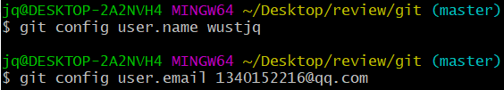
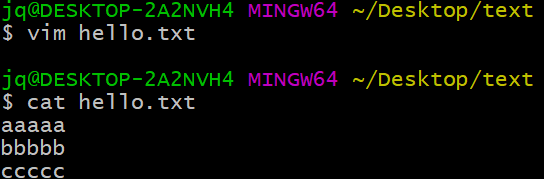
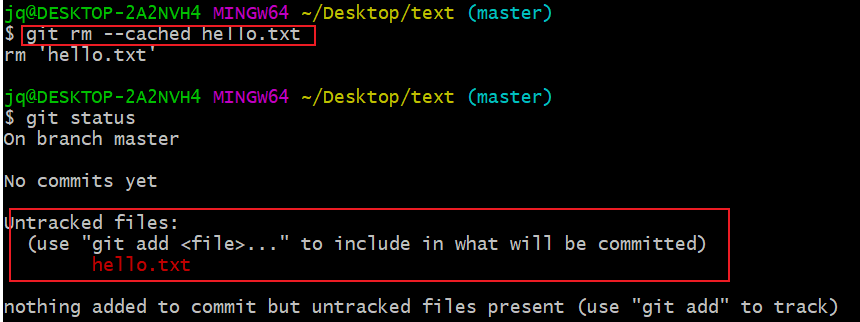

# Git & GitHub

## Git简介

## 1.1 版本控制具备的功能

* **协同开发**：多人并行不悖的修改服务器端的同一个文件。
* **数据备份**：不仅保存目录和文件的当前状态，还能够保存每一个提交过的历史状态。
* **版本管理**：在保存每一个版本的文件信息的时候要做到不保存重复数据，以节约存储空
  间，提高运行效率。这方面 SVN 采用的是**增量式管理**的方式，而 Git 采取了**文**
  **件系统快照**的方式。
* **权限控制**：对团队中参与开发的人员进行权限控制。对团队外开发者贡献的代码进行审核——Git 独有。
* **历史记录：**查看修改人、修改时间、修改内容、日志信息。将本地文件恢复到某一个历史状态。
* **分支管理：**允许开发团队在工作过程中多条生产线同时推进任务，进一步提高效率。

Git官网：https://git-scm.com/

## 1.2 Git优势

* 大部分操作在本地完成，不需要联网
* 完整性保证：对每次数据提交都会进行hash操作
* 尽可能添加数据而不是删除或修改数据
* 分支操作非常快捷流畅
* 与 Linux 命令全面兼容

 

## 1.3本地库和远程库交互方式

### 1.3.1 团队内部协作

### 1.3.2 跨团队协作

## 1.4 Git命令行操作

### 1.4.1 本地库初始化 git init

* 命令：`git init`

* 效果：会在当前目录下创建一个 `.git`的隐藏文件.`

  

 .git   目录存放的是与本地库相关的目录和文件，不要删除

### 1.4.2 设置签名 git config

作用：用来区分不同开发人员身份    

辨析：这里设置的签名和登录远程库(Github)的账号密码没有任何关系。

* 命令：

  * 项目级别/仓库级别：仅在当前本地库有效  

     `git config user.name 设置的姓名`     `git config user.email 设置的email`       

  * 系统用户级别：登录当前操作系统的用户范围

    `git config --global user.name 设置的姓名`     `git config --global user.email 设置的email` 

    就近原则：项目级别优先于系统用户级别，二者都有时用项目级别的签名

* 效果

  

  

* 项目级别信息保存到`.git`下面的`config`文件

* 系统用户级别信息存放在`~/.gitconfig`

### 1.4.3 查看文件状态  git status

* 命令 ：`git status`

### 1.4.4 添加 git add

流程：新创建的一个文件，必须先要添加到暂存区，然后再提交到本地库；然后可以push推送到远程库

* `git add [filename]`
* 将工作区“新建/修改”添加到暂存区

1.新创建一个文件  `git init`初始化完成后

2.查看文件状态：新创建的文件没有被追踪

3.`git add`添加到暂存区后，在查看文件状态 ：已经被追踪了

4.从暂存区移除文件 `git rm --cashed [filename]`  文件状态又变成未追踪

5.然后通过`git add [filename]`继续提交

### 1.4.5 提交 git commit

* 命令：`git commit [filename]`
* 命令：`git commit -m "给提交的命名" [filename]`  **常用**

将hello.txt文档进行修改  文件状态发生改变  此时相当于你本地文件发生改变了  但是缓存区文件未改变，所以不能直接`git commit`提交

使用`git add`将工作区文件添加到暂存区，然后再用命令提交 或者 `git commit -a` 直接添加并提交，而不能直接`git commit`提交

`git add`后再提交   **这种提交方式常用  直接命名提交**

### 1.4.6 版本控制 git reset --hard

**本质：就是通过移动历史记录中的HEAD指针，实现版本前进后退**

**查看日志：**

* 命令：`git log` 详细显示

* 命令：`git log --pretty=online`  每条记录信息一行显示

* 命令： `git reflog` 常用     **HEAD@{表示从当前版本移动到该版本需要移动步数}**

#### 1.4.6.1 基于索引值实现版本控制 [推荐]

命令：`git reset --hard [局部版本索引值]`   可前进可后退

#### 1.4.6.2 基于^符号实现版本控制

只能用于后退

* 命令： `git reset --hard HEAD^^^`    回退3步

  一个`^`符号退一次

#### 1.4.6.3 基于~符号实现版本控制

* 命令：`git reset --hard HEAD~n`    回退n步

#### 1.4.6.4 reset命令三个参数对比

通过`git reflog`查看本地库变化；通过`git status`查看暂存区的变化；通过本地文件查看工作区的变化；

初始上本地库、暂存区和工作区是同一个版本

* `--soft`参数：仅仅在本地库移动HEAD指针；

  

  相当于你的本地库属新的版本，而暂存区和工作区都处于新的版本，所以对暂存区而言，相当于被修改的文件经过了`git add /git commit -a `，但是没有经过`git commit `提交

  

  如果执行`git commit`提交后，暂存区相当于会和本地库位于同一个版本，但是工作区任然处于上一版本。

* `--mixed`参数：1.在本地库移动HEAD参数；2.重置暂存区；

  

  就相当于本地库和暂存区属于同一版本，工作区还停留在上一版本

  

* `--hard`参数：1.在本地库移动HEAD参数；2.重置暂存区；3.重置工作区；

  而`--hard`参数保证本地库，暂存区和工作区版本保持一致；

git提交的记录(不管创建/删除文件)永远存在，即使你将本地文件删除；

## 1.5 找回本地已删除的文件

**前提：创建的文件已经完成提交，提交到了本地库中；**

操作：通过`git reset --hard [指针指向文件没有删除时候]`

首先完成本地库提交

然后删除本地文件

查看状态，将删除状态提交  只要文件被修改，都需要git add重新提交

查看日志，存在两个版本，一个是hello.txt存在提交的版本，另一个删除hello.txt提交的版本

然后通过版本控制回退到上一版本

将文件继续删除

## 1.6 比较文件前后差异 git diff

命令：`git diff [文件名]`  将工作区文件和暂存区文件进行比较

命令：`git diff [本地库中历史版本]`  将工作区和历史版本进行比较

不带文件名比较多个文件

比较：`git diff [文件名]`  **工作区文件和暂存区**文件进行比较

比较：`git diff [本地库中历史版本]`  将**工作区和历史版本**进行比较

## 1.7 分支

概念：在版本控制过程中，使用多条线同时推进任务。

### 1.7.1 分支的优点：

1.同时并行推进多个功能开发，提高工作效率；

2.各个分支在开发过程中，如果某一个分支开发失败，不会对其他分支有任何影响。失败的分支删除重新开始即可；

### 1.7.2 分支的相关命令

#### 1.7.2.1 查看当前所有分支 git branch -v

`-v`是比较详细显示

命令：`git branch -v`  [推荐]  显示全部分支

#### 1.7.2.2 创建分支 git brach [分支名称]

命令：`git branch [分支名称]`

#### 1.7.2.3 切换分支 git checkout [分支名称]

命令：`git checkout [分支名称]`

#### 1.7.2.4 合并分支 git merge [待合并分支名称]

首先将hot-fix分支文件进行修改

命令：`git merge [待合并分支名称]`

合并分支第一步：切换到接受修改的分支（被合并，增加新内容）上；常将其他分支合并到master，所以切换到master分支上；

合并分支第一步：执行分支合并命令

### 1.7.3 分支合并的问题

描述：两个分支分别对**同一个文件的同一部位**修改，然后将一个分支合并到另一个分支，就会产生冲突；

表现为：

解决方法：

* 编辑文件，删除特殊符号，然后修改文件至满意；
* `git add`
* `git commit -m [文件信息]`   此时后面不能跟文件名，否则报错；

## 1.8 Git原理

### 1.8.1 哈希

哈希是一个系列的加密算法，各个不同的哈希算法虽然加密强度不同，但是有以下几个共同点：

* 不管输入数据的数据量有多大，输入同一个哈希算法，得到的加密结果长度固定。
* 哈希算法确定，输入数据确定，输出数据能够保证不变
* 哈希算法确定，输入数据有变化，输出数据一定有变化，而且通常变化很大
* 哈希算法不可逆

**Git 底层采用的是 SHA-1 算法。**

哈希算法可以被用来验证文件。原理如下图所示：

Git 把数据看作是小型文件系统的一组快照。每次提交更新时 Git 都会对当前的全部文件制作一个快照并保存这个快照的**索引**。为了高效，如果文件没有修改，Git 不再重新存储该文件，而是只保留一个链接指向之前存储的文件。所以 Git 的工作方式可以称之为**快照流**。

**每一个新版本会保存一个快照信息，快照信息里面包含了指向上一版本的信息**

**git创建分支本质：创建一个指针，指向当前版本信息；**即图中testing分支

切换到testing分支，对testing分支提交修改；

修改当前分支，也即是HEAD节点指向谁，谁就是当前分支；

**git切换分支本质：相当于将HEAD节点指向当前分支的指针，即仅仅修改了HEAD指向；**

## 2. GitHub

### 2.1 团队内部协作开发

#### 2.1.1 项目经理创建本地库和远程库

1.创建远程库

2.创建本地库  本地库与远程库可以不同名称；

3.项目经理将文件推送到Github

首先为远程库起一个快捷方式的别名

命令：`git remote -v`    查看本地库中远程网址

命令：`git remote add [别名] [对应远程库HTTPS网址]`

命令：`git push [远程库对应分支网址信息] [本地分支名称]`

推送成功

#### 2.1.2 程序员从远程库进行clone

命令：`git clone [远程库克隆信息]`

克隆的作用：

* 完整的把远程库下载到本地
* 创建origin远程地址别名

* 初始化本地库 不用人为初始化，就已经存在.git 文件

#### 2.1.3 项目经理邀请程序员加入团队

程序员修改代码后推送到项目经理的远程库

将项目经理邀请链接发送给程序员，程序员确认即可；https://github.com/wustjq/study/invitations

加入群组后，程序员再推送才会成功

程序员的代码推送到远程库后，项目经理还需要进行合并操作

程序员：

项目经理：

可以发现，两者都可在远程库看见，但是本地文件并没有被修改。

我们一般不直接pull ，而是先fetch(必须先拉取，不然切换分支看不到的)，再切换到远程库分支进行查看，是否代码已修改好，确认后在merge合并到本地

#### 2.1.4 项目经理合并代码

可发现合并后本地就显示程序员修改代码

`pull = fetch + merge`

**必须先拉取才能合并**

命令：`git fetch [远程库别名] [远程分支名]`   从远程库拉取

命令：`git merge [远程库别名/远程库分支名]`   合并

### 2.2 冲突问题

冲突问题：跟前面分支合并方式一样，**后修改的人需要先将代码拉取下来**，在前人基础上在进行修改；否后修改人直接修改会报错

* 如果不是基于GitHub远程库的最新版所作的修改，不能进行推送，必须先拉取到本地修改；
* 拉取下来后如果进入冲突状态，则按照`1.7.3 分支合并解决`分支冲突解决方法即可

