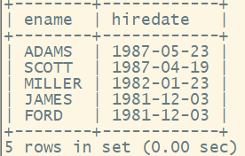
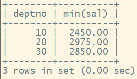

##### 1.取得每个部门最高薪水的人员名称

1.先按部门分组

```sql
select deptno,max(sal) from EMP group by deptno;
```


2.将这个表当临时表与EMP表建立联系

```sql
select  
      e.ename ,t.*
from
     EMP e
join 
    (select deptno,max(sal) maxsal from EMP group by deptno)  t
on
    e.sal = t.maxsal and t.deptno=e.deptno;
```


##### 2.哪些人的薪水在部门的平均薪水之上

1.先按组划分求部门的平均薪水

select deptno ,avg(sal) from EMP group by deptno;


2.表连接求哪些人薪水在平均薪水之上
select 
       e.ename ,e.sal,t.*
from 
      EMP e
join
     (select deptno ,avg(sal) avgsal from EMP group by deptno)  t
on
     e.deptno=t.deptno and e.sal >t.avgsal;


##### 3.取得部门中（所有人的）平均的薪水等级

平均的薪水等级：先计算每一个薪水的等级，然后找出薪水等级的平均值。
平均薪水的等级：先计算平均薪水，然后找出每个平均薪水的等级值。
1.先计算所有人的薪资等级：
select e.ename,e.sal,s.grade from EMP e join SALGRADE s on e.sal between s.losal and s.hisal;

2.
select e.deptno,avg(s.grade) from EMP e join SALGRADE s on e.sal between s.losal and s.hisal group by e.deptno;

select e.ename,e.sal,s.grade from EMP e join SALGRADE s on e.sal between s.losal and s.hisal;

##### 4.不准用组函数（Max ），取得最高薪水（给出两种解决方案）

方法1：用limit  将薪水降序排列取第一个
select  sal from EMP order by sal desc limit 1;
方法2：用表自连的方式  薪水里面肯定没有逼最大的大

1.先找出除了最大薪水的范围  distinct用于去重

select 
         distinct e.sal 
from 
        EMP e
join  
       EMP d
on
       e.sal<d.sal ;


 2.然后用表查找不在这些范围内的
select sal from EMP where sal not in (select distinct e.sal from EMP e join  EMP d on e.sal<d.sal );
    

##### 5.取得平均薪水最高的部门的部门编号（至少给出两种解决方案）

1.方法1：用limit 按部门分组 按平均薪资降序排列取1

select deptno ,avg(sal) avgsal from EMP group by deptno order by avgsal desc limit 1;

2.方法2：参照题目4方法

按照部门分组 求得部门平均薪水对部门
select deptno ,avg(sal) avgsal from EMP group by deptno;
2.1 先找出去除最高平均薪水得组
select 
      distinct e.deptno 
from 
     (select deptno ,avg(sal) avgsal from EMP group by deptno) e
join 
     (select deptno ,avg(sal) avgsal from EMP group by deptno) d
on 
     e.avgsal <d.avgsal;


2.2 然后用表查找不在这些范围内的
select distinct deptno from EMP where deptno not in 
(select distinct e.deptno from (select deptno ,avg(sal) avgsal from EMP group by deptno) e join  (select deptno ,avg(sal) avgsal from EMP group by deptno) d on e.avgsal <d.avgsal);


方法3：用max方法：
select deptno,avg(sal) avgsal from EMP group by deptno;

select max(t.avgsal) from (select deptno,avg(sal) avgsal from EMP group by deptno) t;
然后建立连接 找出deptno
select deptno,avg(sal) avgsal from EMP group by deptno having avgsal =(select max(t.avgsal) from (select deptno,avg(sal) avgsal from EMP group by deptno) t);

##### 6.取得平均薪水最高得部门名称

1.按部门分组求平均薪水
select deptno ,avg(sal) avgsal from EMP group by deptno order by avgsal desc limit 1;


2.用临时表与DEPT表建立外连接
select 
         d.dname
from 
        DEPT d
join  
       (select deptno ,avg(sal) avgsal from EMP group by deptno order by avgsal desc limit 1)   e
on
      e.deptno=d.deptno;  
    

##### 7.求平均薪水的等级最低的部门的部门名称

1.按部门分组 求平均薪睡和对应部门
select deptno,avg(sal) avgsal from EMP group by deptno;


2.然后跟薪水等级表和dept部门表进行连接
select 
        d.dname,e.*,s.grade
from 
        (select deptno,avg(sal) avgsal from EMP group by deptno) e     
join 
      SALGRADE s
on 
      e.avgsal between s.losal and s.hisal
join 
     DEPT d
on
    e.deptno=d.deptno 
order by 
     e.avgsal  
limit 1;     


##### 8.取得比普通员工( 员工代码没有在 mgr  字段上出现的) 的最高薪水还要高的领导

1.先找在mgr出现 要排除NULL
select distinct mgr from EMP where mgr is not null;
2.找普通员工最高薪水(员工代码没有在mgr出现得)
select max(sal) from EMP where empno not in (select distinct mgr from EMP where mgr is not null);
3.找出结果
select ename,mgr from EMP where sal >(select max(sal) from EMP where empno not in (select distinct mgr from EMP where mgr is not null));

##### 9.取得薪水最高的前五名员工

select ename ,sal from EMP order by  sal  desc limit 5;


##### 10.取得薪水最高的第六到第十名员工

**limit下标从0开始计算** 切记

select ename ,sal from EMP order by sal desc limit 5,5;


##### 11.取得最后入职的 5 名员工

select ename ,hiredate from EMP order by hiredate desc limit 5;


##### 12.取得每个薪水等级有多少员工

select 
   s.grade ,count(*)
from 
   EMP e
join 
   SALGRADE s
on 
   e.sal between s.losal and s.hisal group by s.grade;


1.先求每个员工的薪水等级
select e.ename,e.sal,s.grade from EMP e join SALGRADE s on e.sal between s.losal and s.hisal;
2.按照薪水等级分组
select s.grade,count(*) from EMP e join SALGRADE s on e.sal between s.losal and s.hisal group by s.grade;


##### 13.面试题

学生表S（SNO，SNAME）代表（学号，姓名）
课程表C（CNO，CNAME，CTEACHER）代表（课号，课名，教师）
学生选课表SC（SNO，CNO，SCGRADE）代表（学号，课号，成绩）

1.找出没选过黎明老师课的学生姓名？
首先课是老师黎明的  选出是他的学生 然后再not in
select 
       distinct s.sname
from 
       c c 
join
      sc sc
on
      c.cno =sc.cno
join 
      s s
on
      s.sno=sc.sno 
where 
     c.cteacher='黎明';
然后利用not  in排除 
select sname from s where sname not in (select distinct s.sname from  c c join sc sc on c.cno=sc.cno join  s s on s.sno=sc.sno  where  c.cteacher='黎明');


2.列出 2 门以上（含2 门）不及格学生姓名及平均成绩

列出每个人不及格的门数
select 
      s.sname,count(*)
from 
      c c
join
      sc sc
on
     c.cno=sc.cno
join
    s  s
on
   s.sno=sc.sno
where
     sc.scgrade<60
group by 
     s.sname
having
      count(*)>=2;


3.即学过 1 号课程又学过 2 号课所有学生的姓名。
知道一个人上过哪些课程？

##### 14.列出所有员工及领导的姓名

select
     e.ename  '员工', d.ename '领导'
from 
     EMP e
left join 
     EMP d
on
    e.mgr=d.empno;


##### 15.列出受雇日期早于其直接上级的所有员工的编号, 姓名和部门名称

select  
       e.empno,e.ename ,t.dname
from 
      EMP e
join 
      EMP d
on 
      e.mgr =d.empno
join 
     DEPT t
on 
     e.deptno =t.deptno 
where 
     e.hiredate <d.hiredate;


##### 16.列出部门名称和这些部门的员工信息,同时列出那些没有员工的部门

以部门表为主表

select 
        d.dname,e.*
from 
       EMP  e
right join 
      DEPT  d
on 
     e.deptno=d.deptno;


##### 17.列出至少有 5个员工的所有部门

方法1：比较直接的方法

select deptno ,count(*) from EMP group by deptno having count(*)>=5;

方法2：按部门分组

select  
      deptno,count(*) countvalue
from 
     EMP e
group by 
     deptno;


select 
        d.dname ,e.countvalue
from 
        DEPT d
join 
     (select  deptno,count(*) countvalue from  EMP e group by  deptno) e
on 
      d.deptno=e.deptno
where 
      e.countvalue>=5;


##### 18、列出薪金比"SMITH"多的所有员工

找出Smith薪水
select  sal from EMP where ename ='SMITH'; //这里求就不要加名字了  因为不然下面又要加 join 连接 只有一个薪水元素就不用加
select e.* from EMP e  where e.sal >(select sal from EMP where ename ='SMITH');


##### 19、 列出所有"CLERK"( 办事员) 的姓名及其部门名称,部门的人数

select ename ,deptno from EMP where job='CLERK';

select deptno,count(*)  countvalue from EMP group by  deptno;


select 
      e.*,d.dname,t.countvalue
from 
      DEPT d
join 
     (select ename ,deptno from EMP where job='CLERK') e
on
    d.deptno=e.deptno
join 
    (select deptno,count(*)  countvalue from EMP group by  deptno) t
on 
    d.deptno=t.deptno;


##### 20.列出最低薪金大于 1500 的各种工作及从事此工作的全部雇员人数.

select job ,count(*) from EMP group by job having  min(sal)>1500;


##### 21.列出在部门"SALES"< 销售部> 工作的员工的姓名, 假定不知道销售部的部门编号.

首先利用销售部门查出对应的部门编号
select deptno from DEPT where dname='SALES';
然后再查找对应的员工姓名 两个都行

select ename from EMP where deptno=(select deptno from DEPT where dname='SALES');

select e.ename from EMP e join (select deptno from DEPT where dname='SALES') d on e.deptno=d.deptno;


##### 22.列出薪金高于公司平均薪金的所有员工, 所在部门, 上级领导, 雇员的工资等级 

求出工资平均薪资
select avg(sal) avgsal from EMP ;

select 
        e.ename  '员工' ,e.deptno '部门', d.ename '领导名称',e.sal '薪水',s.grade '薪资等级'
from 
        EMP e
 left join 
        EMP d
on
        e.mgr=d.empno
join 
      SALGRADE s
on 
     e.sal between s.losal and s.hisal 

having 
       e.sal>(select avg(sal) avgsal from EMP);


##### 23.列出与"SCOTT"从事相同工作的所有员工及部门名称

1.找出scott从事工作
select  job from EMP where ename ='SCOTT';
2.找出对应工作的人
select 
     e.ename ,d.dname 
from 
     EMP e
join 
    DEPT d
on 
    e.deptno=d.deptno
where 
    e.job=(select  job from EMP where ename ='SCOTT') and e.ename <>'SCOTT';


##### 24.列出薪金等于部门 30 中员工的薪金的其他员工的姓名和薪金.

1.找出部门30的员工薪资
select sal from EMP where deptno=30;


2.找出对应的员工
select ename ,sal from EMP where sal in (select sal from EMP where deptno=30) and deptno<>30;

##### 25.列出薪金高于在部门 30  工作的所有员工的薪金的员工姓名和薪金. 部门名称

找出部门30最高工资
select max(sal) from EMP group by deptno having deptno=30；

select 
       e.ename ,e.sal ,d.dname
from
      EMP e
join
     DEPT d
on
    e.deptno=d.deptno 
where
    e.sal >(select max(sal) from EMP group by deptno having deptno=30);


##### 26.列出在每个部门工作的员工数量, 平均工资和平均服务期限.

找出部门和对应员工数量

select deptno ,count(*)  countvalue,avg(sal) avgsal from EMP group by deptno;

select  
       d.dname ,  e.countvalue ,e.avgsal 
from 
      (select deptno ,count(*)  countvalue,avg(sal) avgsal from EMP group by deptno)  e
join
       DEPT d
on
     e.deptno=d.deptno;        
  

##### 27.列出所有员工的姓名、部门名称和工资

select e.ename ,d.dname ,e.sal from EMP e join DEPT d on e.deptno=d.deptno;

##### 28.列出部门的详细信息(部门编号，部门名称，部门位置)和人数

select deptno,count(*) countvalue from EMP group by deptno;

select 
         d.*,e.countvalue
from 
         DEPT d
left join 
         (select deptno,count(*) countvalue from EMP group by deptno)  e
on 
        e.deptno=d.deptno;


##### 29.列出各种工作的最低工资及从事此工作的雇员名称

按照工作分组 即最低工作

select job,min(sal) minsal from EMP group by job;


select
        e.ename ,d.*
from 
       EMP  e
join 
      (select job,min(sal) minsal from EMP group by job)  d
on 
     e.job=d.job and d.minsal=e.sal; 


select
        e.ename ,d.*
from 
       EMP  e
join 
      (select job,min(sal) minsal from EMP group by job)  d
on 
     e.job=d.job where d.minsal=e.sal; 

##### 30、列出各个部门的 MANAGER( 领导)的最低薪水

select deptno ,min(sal) from EMP where job='MANAGER'  group by deptno;


##### 31、列出所有员工的年工资,按年薪从低到高排序

select  ename,sal *12  yearsal from EMP order by yearsal ;

##### 32.求出员工领导的薪水超过 3000 的员工名称与领导名称

select  
        e.ename,t.ename,t.sal
from 
        EMP e
join 
      EMP   t
on
     e.mgr=t.empno
where 
     t.sal >3000;

##### 33.求出部门名称中带'S' 字符的部门员工的工资合计、部门人数

找出部门中含有s的部门

select  dname ,deptno from DEPT where  dname like '%S%';


select deptno,count(*) countvalue from EMP group by deptno;


select deptno,sum(sal)  sumsal from EMP group by deptno;


select  a.* ,c.sumsal,b.countvalue from 
           (select  dname ,deptno from DEPT where  dname like '%S%') a
 left join 
           (select deptno,count(*) countvalue from EMP group by deptno)   b
on  
          a.deptno=b.deptno
left join 
         (select deptno,sum(sal)  sumsal from EMP group by deptno)  c
on
        a.deptno =c.deptno;
