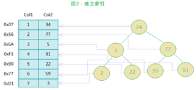
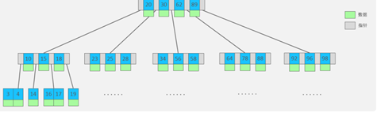
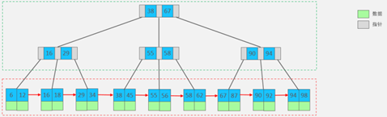
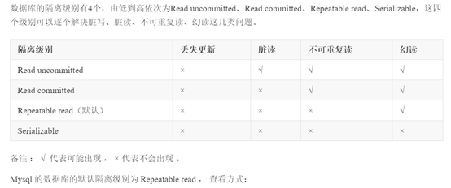

### 1.分类

DQL：数据查询语言，带有`select`关键字

DML：数据操作语言，对表中数据进行操作 `insert`， `delete`， `update`

DDL：数据定义语言，对表结构更改 `create`，`drop`，`alter`


### 2.count(具体字段)和count(*)

count(具体字段)：表示统计该字段下所有不为NULL的元素的总数。

count(*)：统计表当中的总行数。（只要有一行数据count则++）


### 3.delete和truncate

两者都可以用来删除数据

delete：表中数据被删除，但是在硬盘上真实储存空间不会被释放，**所以删除效率低，支持回滚。**

truncate：**删除效率高，属于物理删除，不支持回滚，所以删除速度快。**


### 4.内连接和外连接

内连接和外连接：外连接的话两张表之间产生了主次关系(left/right) 内连接两张表没有主次关系

left/right：表示join关键字左/右边的表为主表，将主表数据全部查询出来，顺便查询右/左表。

**外连接查询结果条数>=内连接查询结果条数**


### 5.外键约束

被引用的称为父表，引用别人的称为子表

删除表的顺序？先删子，再删父。创建表的顺序？先创建父，再创建子。

删除数据的顺序？先删子，再删父。插入数据的顺序？先插入父，再插入子。

主表t_class  子表t_student

```sql
create table t_class(
	classno int primary key,
    classname varchar(255)
);

create table t_student(
	no int primary key auto_increment,
	name varchar(255),
	cno int,
	foreign key(cno) references t_class(classno)
);
```

1.子表中的外键引用的父表中的某个字段，被引用的这个字段必须是主键吗？

​	不一定是主键，但至少具有unique约束。

2.外键可以为NULL吗？

​	外键值可以为NULL。

3.验证外键：

子表外键指定是 ON DELETE RESTRICTON UPDATE CASCADE

1.删除主表数据时，如果子表有对应记录 则不允许删除。

2.更新主表数据时，如果子表有对应记录，则子表数据更新。


### 6.数据库设计三范式

第一范式：要求任何一张表必须有主键，每一个字段原子性不可再分。

第二范式：建立在第一范式的基础之上，要求所有非主键字段完全依赖主键，

​       			不要产生部分依赖。

第三范式：建立在第二范式的基础之上，要求所有非主键字段直接依赖主键，

​                    不要产生传递依赖。


### 7.sql执行顺序

```sql
select 
…
   from 
      join on join on …
   where 
       …
   group by 
       …
   having 
       …
   order by 
       …
   limit 
```

执行顺序 from, where, group by, having, select ,order by, limit


### 8.操作命令

1.创建表

```sql
create table 表名(
	字段名1 数据类型，
	字段名2 数据类型，
);
```

2.删除表

```sql
drop table 表名； drop table if exists 表名；
```

3.向表中插入数据

```sql
insert into表名(字段名1，字段名2，字段名3…..)  values(值1，值2，值3);
```

如果值的顺序排列跟建表时字段排列顺序一致 可以省略字段名,可以一次插入多条记录：

```sql
insert into 表名(字段名1，字段名2...)  values(值1，值2), (值1，值2)...
```

4.更新表

```sql
update 表名 set  字段名1=值1,字段名2=值2,字段名3=值3…where 条件
```

如果没有条件限制会导致所有数据全部更新

5.删除数据

```sql
delete from 表名 where 条件；
```

没有条件整张表都会删除

6.给表添加，删除字段

```sql
alter table 表名 add 字段名 类型 约束条件;
```

alter table dept add id char(1) unique;
alter table dept drop 字段名;

7.创建索引

根据哪个字段创建索引

```sql
create index 索引的名称 on 表名(哪个字段); 
```

利用`alter`来创建索引：

```sql
普通索引：alter table 表名 add index 索引名字(哪个字段)；
唯一索引：alter table 表名 add unique 索引名字(哪个字段)；
主键索引：alter table 表名 add primary key(哪个字段);
全文索引：alter table 表名 add fulltext 索引名字(哪个字段)；
```


### 9.索引

索引是帮助高效获取数据的数据结构

**索引的优劣势：**

​	索引可以提升数据检索效率，降低数据库IO成本。

​	索引列对数据进行排序，降低排序成本 降低CPU消耗。

​	索引也是一张表，因此索引存储也是要占用存储空间的。

​	降低表的更新速度：因为更新表时候 不仅要保存数据 还要保存索引列更新的数据。


### 10.存储引擎

存储引擎：就是存储数据，建立索引，更新查询数据等技术实现方式

存储引擎基于表的 主要有`InnoDB`  `MyISAM`   `Memory` ` MERGE`

​                           事物安全              锁机制                     支持外键

InnoDB                  支持                     行锁                          支持

MyISAM             不支持                   表锁                         不支持

Memory 存储在内存中，访问速度快。可能由于断电问题 造成数据丢失 所以只能用作临时存储  。

**表锁**：操作时，会锁定整个表  开销小，加锁快，所得粒度大 不会出现死锁，发生锁冲突概率高，并发度低。

**行锁**：操作时，会锁定当前行。开销大，加锁慢，所得粒度小 会出现死锁，发生锁冲突概率低，并发度高。

InnoDB 实现了以下两种类型的行锁。

1.共享锁（S）：又称为读锁，简称S锁，共享锁就是多个事务对于同一数据可以共享一把锁，都能访问到数据，但是只能读不能修改。

2.排他锁（X）：又称为写锁，简称X锁，排他锁就是不能与其他锁并存，如一个事务获取了一个数据行的排他锁，其他事务就不能再获取该行的其他锁，包括共享锁和排他锁，但是获取排他锁的事务是可以对数据就行读取和修改。

对于UPDATE、DELETE和INSERT语句，InnoDB会自动给涉及数据集加排他锁（X)；执行完成后就会立即释放排他锁 对于普通SELECT语句，InnoDB不会加任何锁；

#### 10.1 二叉搜索树：

最坏O(n)也就是形成链表   平均复杂度O(log(n))



1.非叶子节点最多只允许两个子节点存在

2.任何一个左子树都比当前节点小，任何一个右子树都比当前节点大

缺点：当顺序插入的时候，会形成一个链表，查询性能大大降低，层级越深速度越慢。

#### 10.2 平衡二叉树

在二叉搜索树的基础上，还有一个特点：节点左右两个子树高度差不能超过1，删除数据的时候会导致树失衡

#### 10.3 红黑树

对红黑树进行插入和删除的时候，需要进行左旋右旋操作保证红黑树性质。

1.节点只有红色和黑色 2.根节点是黑色 3.叶子节点是黑色 4.每个红色节点的两个子节点都是黑色 5.任意一个节点到其叶子节点都有相同的黑色节点。

缺点：数据量大的时候，数的层级太深，查询效率还是太低了

相较于平衡二叉树，红黑树的平衡条件放宽了。平衡二叉树要求左右子树高度差不超过**1**，而红黑树则要求左右子树高度差不超过**1倍**之类。

#### 10.4 B树

树的度数：指树的节点中最多子节点个数。

1.m阶度数的B树，每一个节点最多储存m-1个key，对应有m个指针

2.一旦节点储存key数量达到m，就会裂变，中间元素向上分裂

3.B树中，非叶子节点和叶子节点都会存放数据



#### 10.5 B+树

在B树基础上：

1.所有数据都会出现在叶子节点，非叶子节点只是起到索引作用

2.叶子节点形成一个有顺序的单向链表



Mysql中B+树，在B+树基础上，进行了优化，增加了相邻叶子节点的链表指针


InnoDB为什么使用B+ 树而不是用B树：

​        使用B+树而不是用B树：B+树只有叶子节点存放数据，非叶子节点作为索引，而B树叶子和非叶子节点都存放数据，而每一个节点都是通过一个页(16K)来存储的，B+非叶子节点不存放数据，所以一个节点可以存放的指针和key指更多，所以树的层级就更小。且B+树叶子节点是双向链表，更容易搜索和排序。

哈希索引仅仅支持等值匹配 不支持范围匹配

### 11.事物

**事物会把所有操作作为一个整体向系统提交，操作要么同时成功 要么同时失败**。

事物的四大特性：

**原子性(Atomicity)**：事物是不可分割的最小操作单元，要么全部成功 要么全部失败。

**一致性(Consistency)**：事物完成时，必须所有数据保持一致的状态。

**隔离性(Isolation)**：数据库提交的隔离机制，保证事物不受外部操作的影响。

**持久性(Durablilty)**：事物完成时，他对数据库中数据的改变是永久的。


### 12.SQL优化

定位低效率SQL：

1.慢查询日志：按照我们设定的时间标准，如果执行语句超过这个时间，数据放到慢查询日志

2.show processlist

最左前缀法则：如果对多个字段创建了联合索引，要遵守最左前缀法则。指的是查询从索引最前列开始，并且不跳过索引中间列。

//根据三个字段创建联合索引

```sql
create index idx_seller_name_sta_addr on tb_seller(name,status,address);
```

**1.最左前缀要遵守，or有前走后不走**

​    **最左前缀要遵守：**

```sql
select * from tb_seller where name =’小米科技’ and status=’1’ and address=’北京市’; 走索引
select * from tb_seller where name =’小米科技’ and status=’1’; 走索引
select * from tb_seller where name =’小米科技’; 走索引
select * from tb_seller where name =’小米科技’ and address=’北京市’; 不走索引
select * from tb_seller where name =’小米科技’ and address=’北京市’ and status=’1’; 走索引
```

​    **or前走后不走：**

name字段是索引列，time不是索引列：

```sql
select * from tb_seller where name =’小米科技’ and time=’1992’  走索引 
select * from tb_seller where name =’小米科技’ or time=’1992’ 不走索引
```

**2.索引列上少计算，范围之后全失效**

​    **索引列上少计算**

```sql
select * from tb_seller where substring(name,3,2)=’科技’; 不走索引
```

​    **范围之后全失效:**

```sql
select * from tb_seller where name =’小米科技’ and status=’1’ and address=’北京市’;走联合索引
select * from tb_seller where name =’小米科技’ and status>’1’ and address=’北京市’; 只走name索引
```

**3.like百分写最右，覆盖索引不加星**

​    **like百分写最右:**

```sql
select * from tb_seller where name like ‘黑马%’; 走索引
select * from tb_seller where name like ‘%黑马%’; 不走索引
```

​    **覆盖索引不加星** ：只根据索引字段查询

**4.varchar引号不能丢，全表索引选最优**

​    **varchar引号不能丢**:

```sql
select * from tb_seller where name =’小米科技’ and status=’1’; 走联合索引
select * from tb_seller where name =’小米科技’ and status=1;  只走name索引
```

​    **全表索引选最优:**

该table name全不为空 

 ```sql
select * from tb_seller where name is null; 走索引
select * from tb_seller where name is not null; 不走索引
 ```

因为数据大量非空，mysql觉得走索引还不如全表扫描更快

索引扫描：1.扫描索引得到对应的rowid 2.再根据rowid从表中读取数据。 rowid和索引存在表中


### 13.并发事物带来的问题

1.脏读：一个事物读取到另一个事物还没有提交的数据

2.不可重复度：一个事物先后读取同一个数据，两次读取数据不一致

3.幻读：一个事务按照相同的查询条件重新读取以前查询过的数据，其他事务插入了满足其查询条件的新数据。



行锁升级为表锁：

id,name都是索引，由于执行更新时， name字段本来为varchar类型， 我们是作为数组类型使用(就是没有加上单引号)，存在类型转换，索引失效，最终行锁变为表锁 ；

间隙锁：当我们用范围条件检索数据，并请求共享或排他锁时，InnoDB会给符合条件的已有数据进行加锁； 对于键值在条件范围内但并不存在的记录，叫做 "间隙（GAP）" ， InnoDB也会对这个 "间隙" 加锁，这种锁机制就是所谓的 间隙锁（Next-Key锁）。

eg:原来id有1 2 3 6 7 8 9

update table set name=’jq’ where id<’10’;  会将上面id对应name字段全部修改，于此同时，对不存在的id4,5会加上间隙锁，当你再插入4,5数据时，会被阻塞 只有你提交事物才会成功。