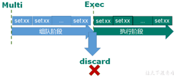
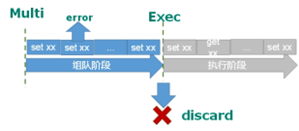
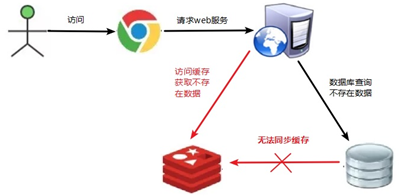
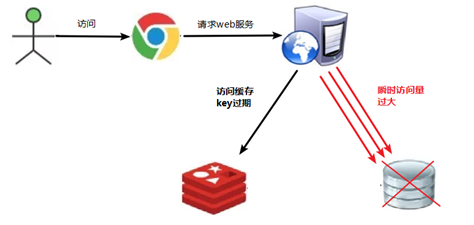
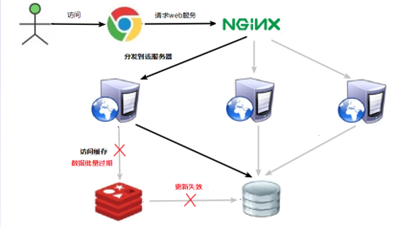

### redis

**redis是单线程+多路IO复用技术实现 支持内存操作+持久化储存**，主要用于高并发海量数据读写  例如秒杀活动  短信验证码等 缓存 消息队列。默认使用0号库 有0-15个库

### 1.redis快的原因

1.redis使用内存储存，没有磁盘IO开销，读写速度快

2.redis是单线程，避免多线程之间线程切换和锁竞争开销

3.redis使用多路IO复用技术，委托内核监控事件，将数据库操作转为事件，不在网络IO上耗时

### 2.redis和MySQL对比

​						MySQL                                                                   Redis

1.结构化：mysql数据都是借助表存储                非结构化：借助key-value实现存储

2.关联性：mysql表和表之间可以借助外键联系                 无关联性

3.SQL查询：有特定的查询语句 select * from tmp;            没有特定SQL

4.ACID事务一致性                                                               无法全部满足事务一致性

5.磁盘存储                                                                                 内存存储

### 3.通用命令

1.keys  pattern :查看复合模板所有key

```sql
keys  *：匹配全部key
keys  a*：匹配以a开头的
```

2.DEL key：删除一个key/多个key

```sql
del name ：删除key为name
del v1 v2 v3 v4：删除key为v1 v2 v3 v4
```

unlink  key 根据key非阻塞删除  首先将key从keys里面删除 但是真正数据删除在后续操作

3.exists  key :判断key是否存在

```sql
exists name : 判断name是否存在
```

4.expire  key :给 key 设置一个有效期  首先你的key要存在

5.ttl  key :查看一个key剩余有效期  有效期为-2 表示已经过期了被移除;有效期为-1 表示永久有效

### 4.常见数据类型

#### 4.1  String类型

1.set：**添加或者修改**已经存在的string类型键值对

```sql
set key value
```

2.get：根据key获取string类型value

```sql
get key
```

3.mset/mget：批量设置或者获取

```sql
mset key1 v1 key2 v2 key3 v3
mget key1 key2 key3
```

4.incr让一个**整形**key自增1 ;incrby  key 6 让一个整形key自增6  设置负值 即可自减

```sql
incr key
incrby key 6
```

5.setnx：添加一个string类型键值对 前提是这个**key不存在** 否则不执行;所以仅仅执行**添加**功能

```sql
setnx key value   等价于   set key value nx
```

6.setex： 添加一个string类型键值对 设置有效期

```sql
setex key seconds value   等价于   set key value ex seconds
```

​        **string的数据结构为简单动态字符串**。类似于切片一样。当字符串长度小于1M时，扩容都是加倍现有的空间，如果超过1M，扩容时一次只会多扩1M的空间。需要注意的是字符串最大长度为512M。

#### 4.2  Hash类型

hash类型也叫散列 ，其value是一个无序字典。hash结构可以将对象的每个字段单独进行修改而string类型是一个整体 不能单独修改。

1.HSET key field value：添加或者修改hash类型key的field的值

```sql
hset heima:user:1 name ‘jq’
```

2.HGET key field：获取一个hash类型key的field的值

```sql
hget heima:user:1 name
```

3.HMSET：批量添加多个hash类型key的field的值

```sql
hmset heima:user:2 name ‘hd’ age 20
```

4.HMGET：批量获取多个hash类型key的field的值

```sql
hmget heima:user:2 name age
```

5.HGETALL：获取一个hash类型的key中的所有的field和value

6.HKEYS：获取一个hash类型的key中的所有的field

7.HVALS：获取一个hash类型的key中的所有的value

8.HINCRBY:让一个hash类型key的字段值自增并指定步长

9.HSETNX：添加一个hash类型的key的field值，前提是这个field不存在，否则不执行

​       **Hash类型对应的数据结构是两种：ziplist（压缩列表），hashtable（哈希表）。当field-value长度较短且个数较少时，使用ziplist，否则使用hashtable。压缩链表本质就是一个数组，一种线性的数据结构。**

#### 4.3  list类型

​         双向链表 可以支持正向检索和反向检索  值在键在 值光键亡。常常用来储存有序数据  例如：朋友圈点赞 评论列表等。

1.有序  2.元素可以重复  3.插入和删除快  4.查询速度一般


1.LPUSH/RPUSH   key   element ... ：向列表左/右侧插入一个或多个元素

```sql
lpush list1 1 2 3    rpush list1 4 5 6
```

2.LPOP/RPOP   key：移除并返回列表左/右侧的第一个元素，没有则返回nil

```sql
lpop list1      rpop list1
```

3.LRANGE key star end：返回一段角标范围内的所有元素

```sql
lrange list1 1 3    //这里式索引下标  左右都是闭区间
```

4.BLPOP和BRPOP：与LPOP和RPOP类似，只不过在没有元素时等待指定时间，而不是直接返回nil


1.如何利用List结构模拟一个栈?

​		入口和出口在同一边

2.如何利用List结构模拟一个队列?

​		入口和出口在不同边

3.如何利用List结构模拟一个阻塞队列?

​		入口和出口在不同边；出队时采用BLPOP或BRPOP


​         **List的数据结构为快速链表quickList**。首先在列表元素较少的情况下会使用一块连续的内存存储，这个结构是ziplist，也即是压缩列表。它将所有的元素紧挨着一起存储，分配的是一块连续的内存。当数据量比较多的时候才会改成quicklist。**因为普通的链表需要的附加指针空间太大，会比较浪费空间。比如这个列表里存的只是int类型的数据，结构上还需要两个额外的指针prev和next。Redis将链表和ziplist结合起来组成了quicklist。也就是将多个ziplist使用双向指针串起来使用。这样既满足了快速的插入删除性能，又不会出现太大的空间冗余。**


#### 4.4  set类型

1.无序

2.元素不可重复

3.查找快

4.支持交集、并集、差集等功能


1.SADD key member ... ：向set中添加一个或多个元素

2.SREM key member ... : 移除set中的指定元素

3.SCARD key： 返回set中元素的个数

4.SISMEMBER key member：判断一个元素是否存在于set中

5.SMEMBERS：获取set中的所有元素

6.SINTER key1 key2 ... ：求key1与key2的交集

7.SDIFF key1 key2 ... ：求key1与key2的差集

8.SUNION key1 key2 ..：求key1和key2的并集


将下列数据用Redis的Set集合来存储：

张三的好友有：李四、王五、赵六

李四的好友有：王五、麻子、二狗

创建set  ：

```sql
sadd zs ls ww zl     
sadd ls  ww mz eg
```

1.计算张三的好友有几人

```sql
scard zs
```

2.计算张三和李四有哪些共同好友

```sql
sinter zs ls
```

3.查询哪些人是张三的好友却不是李四的好友

   ```sql
 sdiff zs ls
   ```

4.查询张三和李四的好友总共有哪些人

    ```sql
sunion zs ls 
    ```

5.判断李四是否是张三的好友

   ```sql
 sismember zs ls
   ```

6.判断张三是否是李四的好友

    ```sql
sismember ls zs
    ```

7.将李四从张三的好友列表中移除

    ```sql
srem zs ls
    ```


 Set数据结构是一个value为空的哈希表。它的内部也使用hash结构，所有的value都指向同一个内部值。

#### 4.5 SortedSet类型

 SortedSet中的每一个元素都带有一个score属性，可以基于score属性对元素排序，**底层的实现是一个跳表（SkipList）加 hash表。**SortedSet具备下列特性：score可以重复但是member不能重复

1.可排序

2.元素不重复

3.查询速度快


因为SortedSet的可排序特性，经常被用来实现排行榜这样的功能

1  ZADD key score member：添加一个或多个元素到sorted set ，如果已经存在则更新其score值

2  ZREM key member：删除sorted set中的一个指定元素

3  ZSCORE key member : 获取sorted set中的指定元素的score值

4  ZRANK key member：获取sorted set 中的指定元素的排名

5  ZCARD key：获取sorted set中的元素个数

6  ZCOUNT key min max：统计score值在给定范围内的所有元素的个数

7  ZINCRBY key increment member：让sorted set中的指定元素自增，步长为指定的increment值

8  ZRANGE key min max：按照score排序后，获取指定排名范围内的元素

9  ZRANGEBYSCORE key min max：按照score排序后，获取指定score范围内的元素

10  ZDIFF、ZINTER、ZUNION：求差集、交集、并集


将班级的下列学生得分存入Redis的SortedSet中：

Jack 85, Lucy 89, Rose 82, Tom 95, Jerry 78, Amy 92, Miles 76


```sql
zadd key score membe [score member …]
```

```sql
zadd stu 85 jack 89 lucy 82 rose 95 tom 78 jerry 92 amy 76 miles
```

• 删除Tom同学

```sql
zrem key member [member…]
```

```sql
zrem stu tom
```

• 获取Amy同学的分数

```sql
zscore key member
```

```sql
zscore stu amy
```

• 获取Rose同学的排名

```sql
zrank key member
```

```sql
zrank stu rose
```

•查询80分以下有几个学生

```sql
zcount key min max   //统计分数在min max之间个数
```

```sql
zcount stu 0 80 
```

• 给Amy同学加2分

```sql
zincrby key increment member
```

```sql
zincrby stu 2 amy  
```

• 查出成绩前3名的同学

```sql
zrevrange key start stop
```

```sql
zrevrange stu 0 2
```

• 查出成绩80分以下的所有同学

```sql
zrangebyscore stu 0 80
```

**zset底层使用了两个数据结构**

**（1）hash，hash的作用就是关联元素value和权重score，保障元素value的唯一性，可以通过元素value找到相应的score值。**

**（2）跳跃表，根据score的范围获取元素列表。**

**skiplist:每个节点维持了多个指向其他节点的指针，从而达到快速访问的目的**


### 5.redis事务

​         用来保证数据一致性和完整性 比如转账  只有我转账了 对方收到转账 才会提交事物 。Redis事务是一个单独的隔离操作：事务中的所有命令都会序列化、按顺序地执行。事务在执行的过程中，不会被其他客户端发送来的命令请求所打断。Redis事务的主要作用就是串联多个命令防止别的命令插队。

比较：1.mysq事物要么同时成功要么同时失败，而redis可以不是2.mysql事物支持acid，而redis并不是完全满足(有一致性，隔离性和原子性，没有持久性)


为什么redis不支持回滚？

​      redis发生语法错误(对key赋值一个错误类型)，在组队时候无法检测出来，执行时候报错，这属于程序性错误，开发时候就能发现，所以不会出现在生产环境。由于不需要回滚，使得redis内部更加简单，运行效率更快。从输入Multi命令开始，输入的命令都会依次进入命令队列中，但不会执行，直到输入Exec后，Redis会将之前的命令队列中的命令依次执行。


组队的过程中可以通过discard来放弃组队。



1.如果组队时候某个命令错误，执行时候所有队列都会被取消



2.如果执行时候某个命令错误，则只有报错命令不执行 其余命令正常执行


**乐观锁适用于多读的应用类型，这样可以提高吞吐量。Redis就是利用这种check-and-set机制实现事务的**


### 6.持久化存储

#### 6.1 RDB：

​         redis  database **在指定的时间间隔内将内存中的数据集快照写入磁盘， 也就是行话讲的Snapshot快照**，它恢复时是将快照文件直接读到内存里。

1.RDB是如何进行备份的？**过程使用写时复制技术**

​       Redis会单独创建一个子进程来进行持久化，会先将数据写入到一个临时文件中，待持久化过程都结束了，再用这个临时文件替换硬盘中持久化的文件(dump.rdb)。 整个过程中，主进程是不进行任何IO操作的，这就确保了极高的性能。如果需要进行大规模数据的恢复，且对于数据恢复的完整性不是非常敏感，那RDB方式要比AOF方式更加的高效。**RDB的缺点是最后一次持久化后的数据可能丢失**。(原因与配置中save规则有关，比如20s内右3个key变化才进行持久化)

​        为什么不直接同步到持久化文件：可以避免服务器挂了，数据持久化一半，造成数据缺少。所以使用临时文件可以保证数据完整性一致性

优点：

​    1.适合大规模的数据恢复 2.对数据完整性和一致性要求不高更适合使用

​    3.节省磁盘空间  4.回复速度快

缺点：

​    1.fork时候，内存中的数据被复制了一份，所以需要考虑2倍内存容量

​    2.在备份周期一定时间间隔做一次备份，如果redisdown掉了，就会丢失最后一次快照内容

#### 6.2 AOF：

​           append  only file  以**日志**的形式来记录每个数据和写操作（增量保存），**只许追加文件但不可以修改文件**将Redis执行过的所有写指令记录下来(**读操作不记录**)，，redis启动之初会读取该文件重新构建数据，换言之，redis
重启的话就根据日志文件的内容将写指令从前到后执行一次以完成数据的恢复工作

AOF 和RDB同时开启的话，redis以AOF数据为准

（1）客户端的请求写命令会被append追加到AOF缓冲区内；

（2）AOF缓冲区根据持久化策略[always,everysec,no]将操作sync同步到磁盘的AOF文件中；

（3）AOF文件大小超过重写策略或手动重写时，会对AOF文件rewrite重写，压缩AOF文件容量；

（4）Redis服务重启时，会重新load加载AOF文件中的写操作达到数据恢复的目的；

优点：数据同步更新更快，丢失数据概率更低

​         AOF文件可以看得懂 通过redis-check-aof来修复AOF文件 可以处理误操作

缺点：

   	比RDB占用更多储存空间(因为不仅要存储数据还要存储写操作)

   	回复备份速度慢  跟上面个原因差不多

   	每次读写都同步的话 会有一定性能压力

### 7.三种集群模式

#### 7.1 主从复制

​        主机数据更新后，会根据配置和策略自动同步到从机中去。主机以写为主，从机以读为住。

​		主从复制的优点：**读写分离，性能扩展性强(如果读写都在同一台服务器，该服务器压力就会很大)  容灾快速回复(这个从机挂了 还有其他从机可以使用)**

主从复制原理：

​	1.当从服务器连接上主服务器之后，从服务器会向主服务器发送数据同步的消息。

​	2.主服务器接到同步消息后，主服务器会先将数据持久化，比如通过快照写入到rdb文件中，将rdb文件发送给从服务器，从服务器将rdb文件读取，最终完成数据同步过程。

​	3.每次主服务器进行写操作后，会和从服务器进行数据同步 (每次同步都是主服务器主动，除了第一次申请申请同步是从服务器主动)

1.一主多从：

​    	1.当主服务器挂掉了：当主服务器挂掉了，从服务器不会上位，当主服务器再次连接，主服务器任然还是主服务器 

​    	2.当从服务器挂掉了：当从服务器挂掉了再次连接起来不再是原来主服务器的slave，而自己成为master了。对这个服务器再加slaveof <ip><port> 又变成原来主服务器的从服务器，同时原来数据都存在(即使是从服务器挂掉期间写数据任然存在)

2.薪火相传：

​		上一个Slave可以是下一个slave的Master，Slave同样可以接收其他 slaves的连接和同步请求，那么该slave作为了链条中下一个的master, 可以有效减轻master的写压力,去中心化降低风险。

从服务器从主服务器同步数据 又将数据同步给自己下面的从服务器

缺点就是当我中间从服务器挂掉了 我主服务器没办法给从服务器下的从服务器同步数据

3.反客为主：

​		当我的主机挂掉了 在从机输入slaveof no one 当前从机变成新主机。如果自动完成需要哨兵模式

#### 7.2 哨兵模式

反客为主的自动版。当主机挂掉了，根据选举决定哪个从机晋升为新主机

原理：

​		 一个哨兵后台持续监视主服务器，当主服务器挂掉了，哨兵会立即通知从服务器，从服务器根据选举进行上位。原来主服务器就变成从服务器。

从服务器选举规则：

​            1.选择优先级靠前的  值越小优先级越高

​            2.和主服务器数据同步最接近的

​            3.runid最小的的优先  runid是随机生成的

redis内存满了怎么办？

​	1.使用内存淘汰策略：

​		通过配置redis的maxmemory-policy参数。默认值是noeviction，就是不进行删除，如果满了再向内存里面写入就报错。删除最近使用较少的key。删除ttl最小的key，就是临近过期的key。随机删除key

​	2.创建集群，利用集群来分担压力

#### 7.3 Cluster集群模式

**中心化集群的方式：任意一个主节点都可以当作节点的入口**

一个redis集群有很多插槽，当你创建数据时候，集群会根据公式进行计算key属于哪个插槽。集群的每个主节点负责一部分插槽，当你创建的key计算出来的数值位于哪一个主节点插槽部分，就分配到哪个主机点

一个 Redis 集群包含 16384 个插槽（hash slot）， 数据库中的每个键都属于这 16384 个插槽的其中一个

​		节点 A 负责处理 0 号至 5460 号插槽。

​		节点 B 负责处理 5461 号至 10922 号插槽。

​		节点 C 负责处理 10923 号至 16383 号插槽。

比如你创建的key通过计算的数值为1234  就会被分配到A节点上

### 8.Redis应用问题

#### 8.1 缓存穿透



1.现象：

​		1.应用服务器压力变大  2.redis的命中率降低  3.服务器一直会去查询数据库，导致数据库压力过大崩溃。 

2.产生原因：

​		1.可能由于redis缓存不进去数据，导致redis命中率低 可能性较小

​		2.出现很多非正常的url访问，导致redis命中率低，所以数据库压力过大

​		最可能的是网站遭受了恶意攻击

3.解决方法：

​		1.对空值做缓存：即使在redis查找不到数据，也做空值缓存，可以设置较短的过期时间。

  	  2.设置访问的白名单：使用bitmaps类型定义一个白名单，将id作为value，每次访问和bitmap中id比较，如果id不存在，就不允许访问。

  	  3.布隆过滤器：底层也就是bitmap实现

  	  4.进行实时监控：当发现redis命中率降低了，立即排查访问对象，设置黑名单。

#### 8.2 缓存击穿



1.现象：

  	1.数据库访问压力瞬时增大 2.redis没有出现大量key过期  3.redis正常运行

2.产生原因：

  	redis某个key过期了 大量请求访问了这个key，最终访问不到会不断访问数据库  常见比如热门访问的词

3.解决方式：

  	1.预先将热门数据存入到redis中，加大这个热门数据key的时长

  	2.实时调整：实时监控热门数据  实时调整key的时长

 	 3.使用锁：锁虽然可以避免这种现象  但是访问效率会降低

#### 8.3 缓存雪崩



现象：

 	 1.数据库压力变大 应用访问就会变慢 造成大量访问等待 服务器崩溃 数据库崩溃

产生原因：

  	在极短时间内 大量的key都过期了 大量请求访问这些key 访问不到 转而访问数据库 造成数据库压力过大 服务器压力过大 最终导致服务器数据库崩溃

解决方法：

  	1.构建多级缓存架构

  	2.使用锁：让访问求请求不要同时来到  这种效率必然低下

  	3.设置过期标志，更新缓存：提前记录缓存数据是否过期，如果过期通知另外线程去后台实时更新缓存数据

 	 4.将缓存失效时间分隔开：设置过期时间时，尽量不要让key大量集中在某一个时间段 尽量分离开来。


分布式锁：分布式系统分配在不同机器上，在这台机器加锁 对其他机器并没有作用

1.实现：

 	 基于redis缓存

  	基于zookeeper：好像是通过树来实现的，

​	  redis实现：利用setnx设置，如果我的key值存在，设置就失效 类似于锁一样 当我用del删除key 别人才能设置值

2.问题：如果我设置了锁 始终不释放，后面无限期阻塞 解决办法 setnx时候同时设置ex  设置过期时间

set key value nx ex 20 :设置锁的同时 设置过期时间